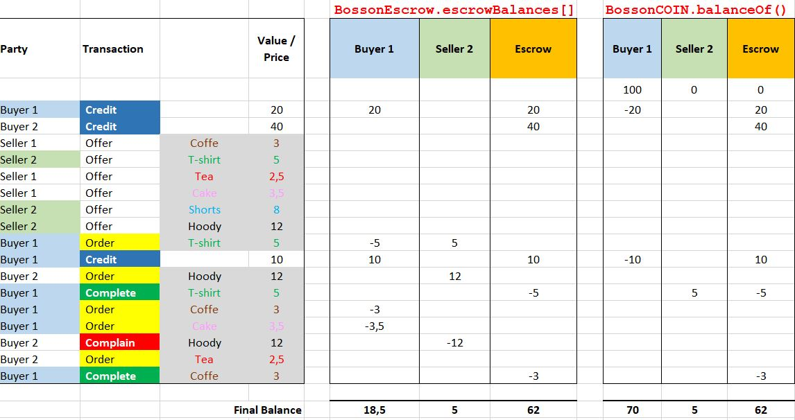

# Boson Protocol Escrow Arrangement

This repository contains the project source code and dependencies required to deploy a ESCROW ARRANGEMENT in Ethereum development network.

## 1. Description

This project implements a simple escrow arrangement in Ethereum network.

The escrow is deployed with the following 2 Ethereum smart contracts written in solidity:

### - *BossonCoin.sol*

This contract defines the token ('bossonCoin') that is used used witin the escrow arrangement to fund account and execute transactions

BossonCoin.sol inherits the standard ERC20 from [OpenZeppelin/ERC20](https://docs.openzeppelin.com/contracts/3.x/erc20), and is initialy minted with 100 coins.

### - *BossonEscrow.sol*

This contract defines all the 'business logic' of the escrow arrangement.

BossonEscrow.sol inherits the Ownable interface from [OpenZeppelin/access/Ownable](https://docs.openzeppelin.com/contracts/3.x/api/access#Ownable) to ensure that only the escrow agent is allowed to perform changes to the contract state variables, such as balances.

The following functions are implemented on BossonCoin.sol:

Functions | Description
--- | ---
`Credit()` | *Transfer BossonCoins from Buyer account to BossonEscrow account*
`Order()` | *Checks Buyer has enough funds on escrow and item availability. Updates internal escrow balances for Buyer and Seller according to item price. Marks item state as AWAITING_DELIVERY*
`Offer()` | *Creates a new item for sale and adds it to the BossonScrow stock of items for sale. Marks item state as OFFERED*
`Complete()` | *Transfer BossonCoins from BossonEscrow account to Seller account. Updates item ownership to Buyer. Marks item state as COMPLETE*
`Complain()` | *Reverts internal escrow balances for Buyer and Seller account according to item price. Marks item state as OFFERED*

## 2. Framework and dependencies

- Source code language: Solidity  
- Development environment: Node.js / NPM / Truffle / Ganache
- Testing: Truffle / Mocha / Chai

## 3. How it all fits together

### - Initial mint
  


### - Example flow for trasaction: **_credit(buyer1, 20)_**


### - Example flow for trasaction: **_order(buyer1, "T-shirt")_**


### - Example flow for trasaction: **_confirm(buyer1, "T-shirt")_**


## 4. Install

Clone repository and install dependencies and devDependencies:

```bash
$ npm install -g truffle
$ npm install -g ganache-cli
$ cd bossonEscrow
$ npm init
```


## 5. Usage

Start ganache-cli development ethereum network:

```sh
$ ganache-cli -d 10000000 --allowUnlimitedContractSize --gasLimit=0x1FFFFFFFF
```

On another terminal, compile and deploy solidity contracts to Ganache development network:

```sh
$ truffle compile
$ truffle migrate
```

## 6. Test

The problem **example input** provided in the technical assignment is coded within the truffle test file *BossonEscrow.assigmentTest.js*:

```javascript
       //execute example input TXs
        await _bossoncoin.approve(_bossonescrow.address, tokens('20'), {from: buyer1})
        await _bossonescrow.credit(buyer1, tokens('20'), {from: escrowAgent})
        await _bossoncoin.approve(_bossonescrow.address, tokens('40'), {from: buyer2})
        await _bossonescrow.credit(buyer2, tokens('40'), {from: escrowAgent})
        await _bossonescrow.offer(seller1, "Coffee", tokens('3'), 10)
        await _bossonescrow.offer(seller2, "T-shirt", tokens('5'), 10)
        await _bossonescrow.offer(seller1, "Tea", tokens('2.5'), 10)
        await _bossonescrow.offer(seller1, "Cake", tokens('3.5'), 10)
        await _bossonescrow.offer(seller2, "Shorts", tokens('8'), 10)
        await _bossonescrow.offer(seller2, "Hoody", tokens('12'), 10)
        await _bossonescrow.order(buyer1, "T-shirt", {from: escrowAgent})
        await _bossoncoin.approve(_bossonescrow.address, tokens('10'), {from: buyer1})
        await _bossonescrow.credit(buyer1, tokens('10'), {from: escrowAgent})
        await _bossonescrow.order(buyer2, "Hoody", {from: escrowAgent})
        await _bossonescrow.complete(buyer1, "T-shirt", {from: escrowAgent})
        await _bossonescrow.order(buyer1, "Coffee", {from: escrowAgent})
        await _bossonescrow.order(buyer1, "Cake", {from: escrowAgent})
        await _bossonescrow.complain(buyer2, "Hoody", {from: escrowAgent})
        await _bossonescrow.order(buyer2, "Tea", {from: escrowAgent})
        await _bossonescrow.complete(buyer1, "Coffee", {from: escrowAgent})
```

- Expected flow of coins and balance state as per **example input**:

 

- Execute truffle test from command prompt:

```sh
$ truffle test
```

- Expected output:

```bash
  Contract: bosson escrow arrangement
    Bosson escrow assigment


         (test console output) Balance buyer1: 18.5
      ✓ Buyer1 balance is 18.5 (106ms)
         (test console output) Balance Seller2: 5
      ✓ Seller2 balance is 5 (101ms)
         (test console output) Escrow internal balance: 62
         (test console output) BossonCoin Escrow account balance:62
      ✓ Escrow balance is 62 (193ms)


  3 passing (6s)
```
